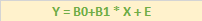

# Regressão linear simples, múltipla e logística.

## Regressão linear simples

> A análise de regresão estuda o **relacionamento** entre uma variável
> **dependente** e outra **independente**. Este relacionamento é
> representado por um **modelo** matemático, isto é, por uma equação que
> relaciona. Tem como objetivo determinar a equação da reta ajustada.

__Problema de estimação de salário__

<table>
    <tr><td>X (Tempo experiência)</td><td>Y (Salário)</td></tr>
    <tr><td>2</td><td>2100</td></tr>
    <tr><td>5</td><td>4000</td></tr>
    <tr><td>8</td><td>6000</td></tr>
    <tr><td>10</td><td>14000</td></tr>
    <tr><td>6</td><td>8000</td></tr>
    <tr><td>7</td><td>5500</td></tr>
    <tr><td>1</td><td>2500</td></tr>
    <tr><td>5</td><td>7000</td></tr>
</table>

Um candidato com 8 anos de experiência pedindo salário de R$ 4000,00. Se
adequa ao salário da empresa ?

1. Descobrir qual é a relação entre a experiência e o salário ?

Formula para descobrir o modelo:

 

- y = Variável dependente
- e = Erro do modelo
- x = Variável de independente

2. Erro quadrático médio / Erro padrão:

ou

ou ainda mais simplificado:

> O modelo é bom ?
Só utilizar o modelo de determinação R² ou

Tabela de qualidade:

<table>
    <tr><td>0</td><td>Não há relação entre as variáveis</td>
    <tr><td>> 0 & < 0.3</td><td>Relação fraca</td>
    <tr><td>> 0.3 & < 0.6</td><td>Relação moderada</td>
    <tr><td>> 0.6 & < 0.8</td><td>Relação forte</td>
    <tr><td>> 0.8</td><td>Relação muito forte</td>
</table>

## Regressão linear múltipla

<table>
    <tr><td>X (Experiência)</td><td>Cursos</td><td>Y (Salário)</td></tr>
    <tr><td>2</td><td>0</td><td>2100</td></tr>
    <tr><td>5</td><td>1</td><td>4000</td></tr>
    <tr><td>8</td><td>2</td><td>6000</td></tr>
    <tr><td>10</td><td>5</td><td>14000</td></tr>
    <tr><td>6</td><td>1</td><td>8000</td></tr>
    <tr><td>7</td><td>3</td><td>5500</td></tr>
    <tr><td>1</td><td>1</td><td>2500</td></tr>
    <tr><td>5</td><td>4</td><td>7000</td></tr>
</table>

y = b0 + b1 x1 + b2x2

T= Transposta b = (xT x)-¹ xTy

b0 = 430,2 b1 = 364,3 b2 = 2210,6

## Logística

               -(b0+ b1x)

Y = 1 / 1 + e

teste estatistico regressão lso